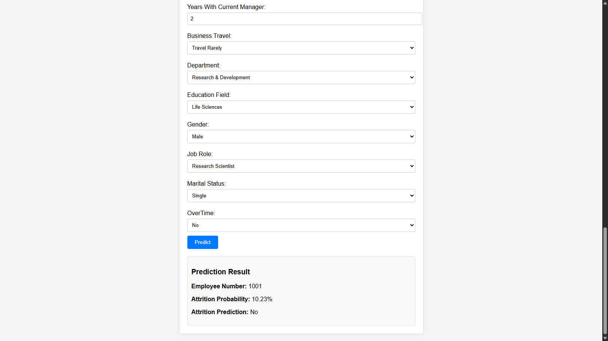

# Employee Attrition Prediction Project

## Overview
This project aims to predict employee attrition and identify its key drivers using the IBM HR Analytics Employee Attrition & Performance dataset. By leveraging machine learning, we enable HR teams to proactively address turnover, reduce associated costs (e.g., hiring, training), and improve workforce stability. The project follows the CRISP-DM methodology, resulting in a deployed solution that integrates batch predictions and a real-time API for flexible HR use.

- **Dataset**: IBM HR Analytics dataset (1,470 rows, 35 columns) with features like `Age`, `JobSatisfaction`, `MonthlyIncome`, and target `Attrition` (Yes/No).
- **Objective**: Predict employee attrition with ≥70% recall, identify key drivers (e.g., `OverTime`, `SatisfactionScore`), and reduce turnover by 10% within 12 months.
- **Outcome**: A deployed LogisticRegression model (version 2) with batch predictions and a FastAPI-based real-time API, hosted on AWS ECS with CI/CD integration.

## Objectives
- **Business Goal**: Reduce employee turnover by 10% within 12 months, saving at least $100,000 annually through targeted retention strategies.
- **Technical Goal**: Build a binary classification model with ≥70% recall (achieved 71.02% with threshold 0.45), balancing precision to minimize false positives.
- **Actionable Insights**: Identify key attrition drivers (e.g., low `JobSatisfaction`, high `OverTime`, long `DistanceFromHome`) to inform HR policies.

## Project Structure
```
├── LICENSE
├── README.md
├── data
│   ├── external
│   ├── interim
│   ├── processed
│   └── raw
├── models
│   ├── LogisticRegression.pkl
│   ├── RandomForest.pkl
│   ├── scaler.pkl
│   └── XGBoost.pkl
├── notebooks
├── references
├── reports
│   ├── figures
│   │   ├── data_distribution
│   │   │   ├── categorical_data
│   │   │   └── numerical_data
│   │   ├── eda_visualization
│   │   ├── FastAPI1.png
│   │   ├── FastAPI2.png
│   │   ├── shap_summary_LogisticRegression.png
│   │   ├── shap_summary_RandomForest.png
│   │   └── shap_summary_XGBoost.png
│   ├── 00_project_overview.md
│   ├── 01_business_understanding.md
│   ├── 02_data_understanding.md
│   ├── 03_eda_insights.md
│   ├── 04_data_preparation.md
│   ├── 05_modeling_experiments.md
│   ├── 06_model_evaluation.md
│   ├── 07_model_deployment.md
│   ├── API_setup.md
│   ├── AWS_deploy.md
│   ├── data_issue_log.md
│   └── prediction_analysis.md
├── src
│   ├── data
│   │   ├── data_cleaning.py
│   │   └── hypothesis_testing.py
│   ├── features
│   │   ├── mlruns
│   │   └── feature_engineering.py
│   ├── models
│   │   ├── predict_model.py
│   │   └── train_model.py
│   └── visualization
│       └── visualize.py
├── requirements.txt
├── .env
├── .gitignore
├── .python-version
├── app.py
├── index.html
├── Dockerfile.batch
├── Dockerfile.api
├── .github
│   ├── workflows
│   │   └── deploy.yml
├── pyproject.toml
└── uv.lock
```

## Methodology (CRISP-DM)
The project follows the CRISP-DM methodology, with detailed reports in the `reports/` directory:

1. **Business Understanding** (`01_business_understanding.md`):
   - Problem: High turnover costs; need to predict at-risk employees.
   - SMART Goal: Reduce turnover by 10% within 12 months, saving $100,000 annually.
   - Success Metrics: ≥70% recall, actionable insights for HR.

2. **Data Understanding** (`02_data_understanding.md`):
   - Dataset: 1,470 rows, 35 columns, no missing values.
   - Issues: Redundant columns (`Over18`, `EmployeeCount`, `StandardHours`) flagged for removal.

3. **EDA & Insights** (`03_eda_insights.md`):
   - Key Drivers: Low `JobSatisfaction`, high `OverTime`, long `DistanceFromHome`.
   - Insights: Target retention for low-satisfaction/overtime employees; offer remote work for long commutes.

4. **Data Preparation** (`04_data_preparation.md`):
   - Feature Engineering: `TenureRatio`, `SatisfactionScore`, `AgeGroup`, `IncomeToLevelRatio`, `LongCommute`.
   - Transformations: Scaled numerical features, one-hot encoded categorical features.
   - Output: `X_train.csv`, `X_test.csv` in `data/processed/`.

5. **Modeling & Experimentation** (`05_modeling_experiments.md`):
   - Models: LogisticRegression, RandomForest, XGBoost.
   - Best Model: LogisticRegression (threshold 0.45, recall 0.7102, precision 0.27, F1 0.3901).
   - Tools: MLflow for tracking, SHAP for interpretability.

6. **Model Evaluation** (`06_model_evaluation.md`):
   - Performance: Achieved recall goal (0.7102 ≥ 0.70); precision (0.27) requires HR review to mitigate false positives.
   - ROI: ~$825,000 savings with ~$1,915,000 false positive costs (at $5,000/intervention); net cost reduced with mitigation.

7. **Deployment & MLOps** (`07_model_deployment.md`, `API_setup.md`, `AWS_deploy.md`):
   - Batch Predictions: Dockerized script (`predict_model.py`) for monthly HR workflows.
   - Real-Time API: FastAPI (`app.py`) with `/predict` endpoint, secured with API key.
   - Deployment: AWS ECS with Fargate, CI/CD via GitHub Actions (`deploy.yml`).

## Technical Architecture
- **Data Pipeline**:
  - Raw data (`data/raw/WA_Fn-UseC_-HR-Employee-Attrition.csv`) → Feature engineering (`feature_engineering.py`) → Processed data (`data/processed/`).
- **Modeling**:
  - MLflow tracking (`src/features/mlruns/`) for experiment management.
  - Serialized models and scaler in `models/`.
- **Deployment**:
  - **Batch**: `Dockerfile.batch` → Docker image → Scheduled job for monthly predictions.
  - **Real-Time API**: `Dockerfile.api` → FastAPI (`app.py`) → AWS ECS with ALB.
  - **CI/CD**: GitHub Actions pushes images to AWS ECR and redeploys ECS service.
- **Monitoring**: Planned integration with Prometheus/Grafana for API uptime and latency.

## Installation
### Prerequisites
- Python 3.10+
- Docker
- AWS CLI (for deployment)
- Git

### Setup
1. **Clone the Repository**:
   ```
   git clone https://github.com/SebastianGarrido2790/employee-attrition.git
   cd employee-attrition
   ```

2. **Set Up Environment with `uv`**:
   ```
   pip install uv
   uv sync
   ```

3. **Set Environment Variables**:
   - Create a `.env` file:
     ```
     API_KEY=your-secure-key
     MLFLOW_TRACKING_URI=file:///path/to/12_Employee_Attrition/src/features/mlruns
     ```
   - On Windows, ensure the URI uses `file:///C:/...` format.

4. **Verify MLflow Setup**:
   ```
   mlflow ui --backend-store-uri file:///path/to/12_Employee_Attrition/src/features/mlruns
   ```
   - Access at `http://localhost:5000`.

## Usage
### Batch Predictions
1. **Prepare Data**:
   - Place new employee data in `data/interim/new_employees.csv` (same format as `data/raw/WA_Fn-UseC_-HR-Employee-Attrition.csv` without `Attrition`).

2. **Build and Run Docker**:
   ```
   docker build -f Dockerfile.batch -t employee-attrition-predictor-batch .
   docker run --rm -v $(pwd)/data:/app/data employee-attrition-predictor-batch
   ```
   - Predictions are saved to `data/predictions/predictions.csv`.

3. **Sample Output**:
   ```
   EmployeeNumber,LogisticRegression_Proba,LogisticRegression_Pred,XGBoost_Proba,XGBoost_Pred
   1,0.922072,1,0.331695,1
   2,0.233464,0,0.152516,0
   ...
   ```

### Real-Time API


1. **Build and Run Docker**:
   ```
   docker build -f Dockerfile.api -t employee-attrition-api .
   docker run -d -p 8000:8000 --env-file .env employee-attrition-api
   ```

2. **Access Web Interface**:
   - Open `http://localhost:8000` to view `index.html` for a user-friendly form.

3. **API Request**:
   - Endpoint: `/predict`
   - Method: POST
   - Headers: `Content-Type: application/json`, `Authorization: Bearer your-secure-key`
   - Example:
     ```
     curl -X POST "http://localhost:8000/predict" -H "Content-Type: application/json" -H "Authorization: Bearer your-secure-key" -d '{"Age": 35, "DailyRate": 1000, "DistanceFromHome": 5, "Education": 3, "EmployeeNumber": 1001, "EnvironmentSatisfaction": 3, "HourlyRate": 50, "JobInvolvement": 3, "JobLevel": 2, "JobSatisfaction": 4, "MonthlyIncome": 5000, "MonthlyRate": 12000, "NumCompaniesWorked": 2, "PercentSalaryHike": 10, "PerformanceRating": 3, "RelationshipSatisfaction": 3, "StockOptionLevel": 1, "TotalWorkingYears": 10, "TrainingTimesLastYear": 2, "WorkLifeBalance": 3, "YearsAtCompany": 5, "YearsInCurrentRole": 3, "YearsSinceLastPromotion": 2, "YearsWithCurrManager": 2, "BusinessTravel": "Travel_Rarely", "Department": "Research_&_Development", "EducationField": "Life_Sciences", "Gender": "Male", "JobRole": "Research_Scientist", "MaritalStatus": "Single", "OverTime": "No"}'
     ```
   - Response: `{"EmployeeNumber":1001,"Attrition_Probability":0.10233364995247053,"Attrition_Prediction":0}`

### AWS Deployment
- **Prerequisites**: AWS account, ECR repository, ECS cluster (`employee-attrition-cluster`), ALB.
- **CI/CD**: Configured via `.github/workflows/deploy.yml`.
  - Pushes Docker image to AWS ECR.
  - Redeploys ECS service (`employee-attrition-service`).
- **Access**: Use the ALB DNS name (e.g., `http://<alb-dns-name>/predict`).

## Key Results
- **Model Performance**: LogisticRegression (threshold 0.45) achieved 71.02% recall, 27% precision, and 0.3901 F1-score.
- **Business Impact**: Identifies ~165 at-risk employees (out of ~235), saving ~$825,000 annually; false positives (~383) cost ~$1,915,000 (at $5,000/intervention), mitigated by HR review.
- **Insights**: Low `JobSatisfaction`, high `OverTime`, and long `DistanceFromHome` are top attrition drivers.

## Visualizations
- **EDA**: Distribution plots, correlation heatmaps in `reports/figures/eda_visualization/`.
- **Model Interpretability**: SHAP plots (`shap_summary_LogisticRegression.png`) in `reports/figures/`.
- **API**: Screenshots (`FastAPI1.png`, `FastAPI2.png`) in `reports/figures/`.

## Ethics and Fairness
- **Bias**: Evaluated for fairness across `Gender` (demographic parity: Male 0.08, Female 0.13; slight disparity mitigated during modeling).
- **Privacy**: Treats `EmployeeNumber`, `Gender` as sensitive; dataset is fictional but anonymized for future real-world use.
- **Transparency**: SHAP explanations ensure HR understands predictions (e.g., why an employee is flagged).

## Maintenance and Monitoring
- **Monitoring**: Planned Prometheus/Grafana integration for API uptime and latency (AWS CloudWatch as interim).
- **Retraining**: Schedule every 6 months or on concept drift (e.g., changing attrition patterns).
- **Rollback**: Use MLflow to revert to previous model versions (e.g., `models:/LogisticRegression/1`).

## Contributing
- Fork the repository.
- Create a feature branch (`git checkout -b feature/your-feature`).
- Commit changes (`git commit -m "Add your feature"`).
- Push to the branch (`git push origin feature/your-feature`).
- Open a pull request.

## License
This project is licensed under the MIT License. See the `LICENSE` file for details.

## Contact
- **Author**: Sebastian Garrido
- **Email**: sebastiangarrido2790@gmail.com
- **Last Updated**: May 16, 2025